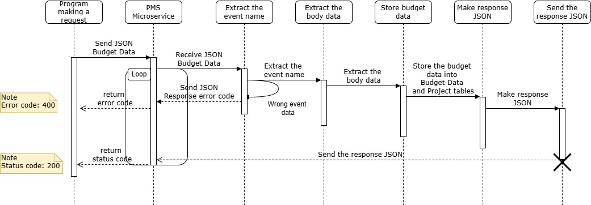
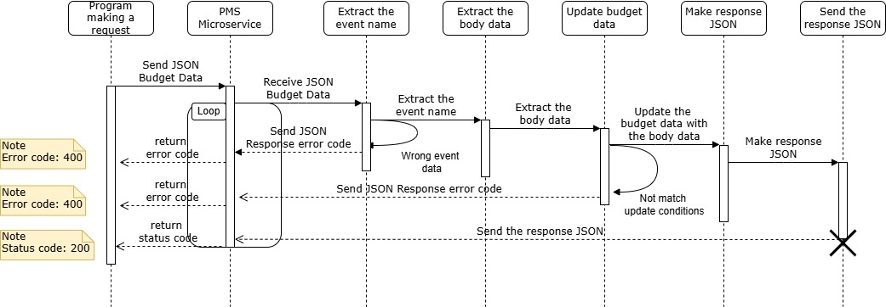
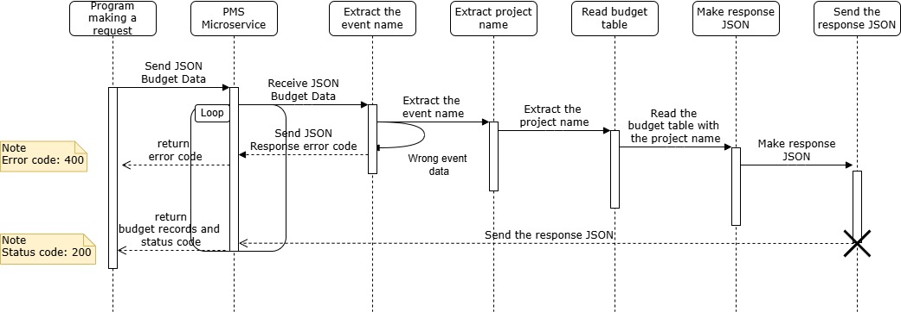
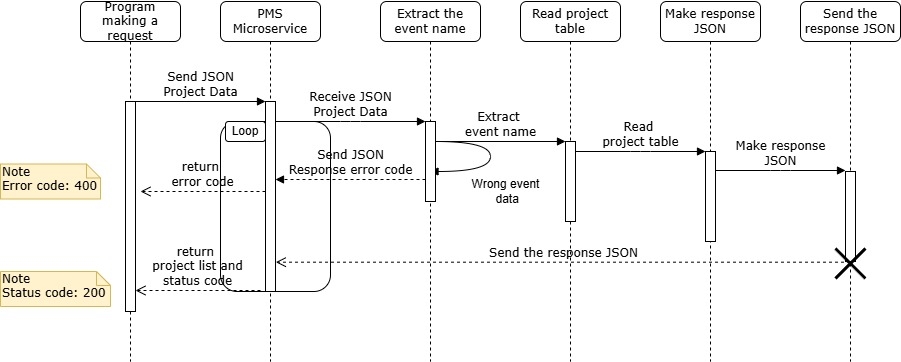

# Planning Management Service

1. Instructions for REQUEST data
1. Instructions for RECEIVE data
1. UML sequence diagram

- Sequence diagram for Register Budget Data

- Sequence diagram for Modify Budget Data

- Sequence diagram for Get Budget Data

- Sequcence diagram for Get Project List
